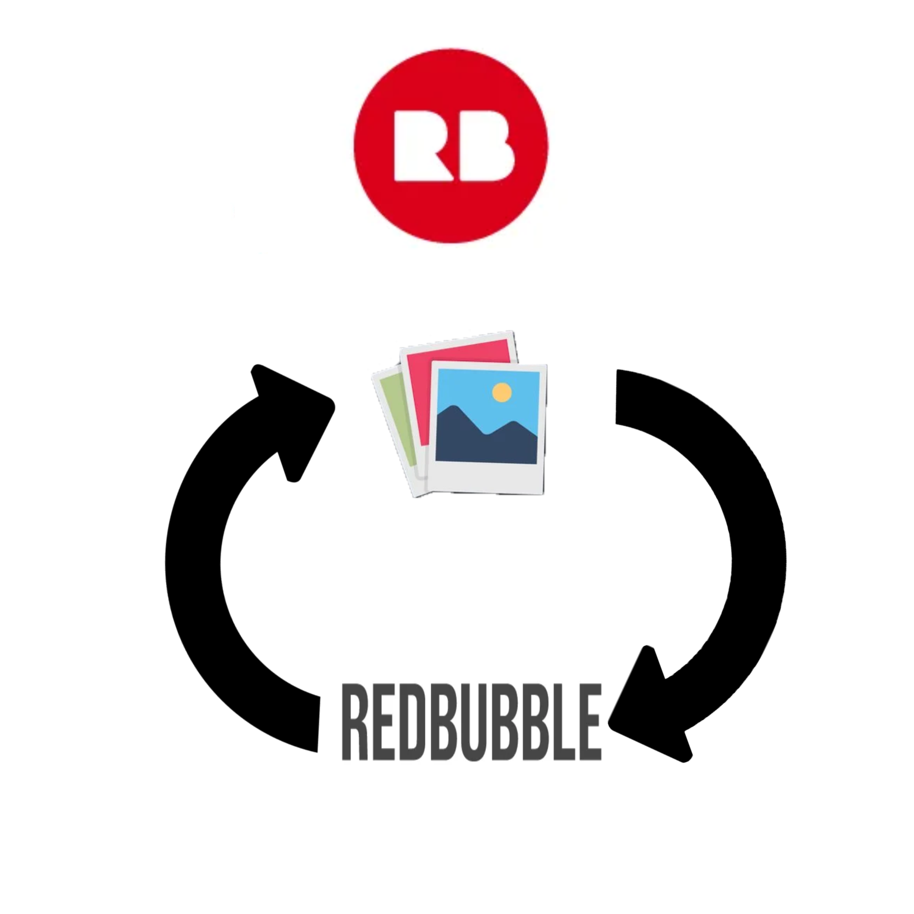

# Redbubble Auto-Uploader

<!-- PROJECT LOGO -->
<br />
<p align="center">
  <a href="https://github.com/github_username/repo_name">
    
  </a>

  <h3 align="center">Redbubble Auto-Uploader</h3>

  <p align="center">
    Automates the RB Upload process
    <br />
    <br />
    <br />
    <a href="https://giphy.com/gifs/7KRENRD6wt6Vdm4iEN">View Demo</a>
    
<!-- ABOUT THE PROJECT -->
## About The Project

Python script with a simple GUI that uploads any number of images from chosen directories to Redbubble.
Uses the Chrome webdriver to interact with Redbubble. 
The webdriver and Chrome profile will automatically be created and saved upon running the script

<!-- GETTING STARTED -->

## Getting Started

Clone the repository
  ```
  git clone https://github.com/jalbrekt85/RedbubbleBot.git
  ```
 Have a Redbubble account with at least 1 design already uploaded.

### Prerequisites

* Python 3.7+
* Google Chrome Install with default installation instructions
* Install required modules
  ```
  pip install -r requirements.txt
  ```

### Run the script

1. Run
   ```
   python uploader.py
   ```
2. A small GUI will appear, select directories with your designs and click upload

3. If this is your first time running the script, you will be prompted to login to redbubble. Login and the script will continue.

The script will you your latest design that you've uploaded as a template for the designs it uploads. 
This can be changed in `get_template_link()`

Manually select a design as the template by copying the duplicate copy URL of the design:
"https://www.redbubble.com/portfolio/images/12345678-artwork-title/duplicate"

## License and Copyright

Licensed under [MIT LICENSE](LICENSE)


